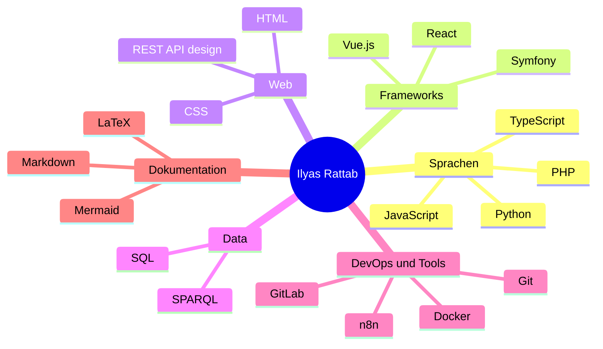

<!--
  Profil-README für github.com/ITC2022  (Deutsch)
  Diese Datei (README.de.md) gehört mit README.md ins ITC2022-Repo.
  Statistiken & Repo-Karten: github-stats-extended.vercel.app  |  Streak: github-readme-streak-stats
  Akzentfarbe: #6C63FF  |  Karten-Theme: tokyonight
-->

<a href="./README.md">English</a> &nbsp;·&nbsp; <b>Deutsch</b>

<h1 align="center">Ilyas Rattab</h1>
<h3 align="center">Full-Stack-Entwickler · Berlin</h3>

  

  <a href="#über-mich">Über mich</a> &nbsp;·&nbsp;
  <a href="#tech-stack">Tech-Stack</a> &nbsp;·&nbsp;
  <a href="#projekte">Projekte</a> &nbsp;·&nbsp;
  <a href="#github-statistiken">Statistiken</a> &nbsp;·&nbsp;
  <a href="#kontakt">Kontakt</a>

---

## Über mich

Full-Stack-Entwickler aus Berlin. Ich baue saubere, lauffähige Web-Anwendungen — meist mit **Vue 3** im Frontend sowie **PHP / Symfony** und **REST-APIs** im Backend, deployt mit **Docker**. Ich mag die Teile der Entwicklung, die Geduld belohnen: Debugging, Dokumentation und das End-to-End-Ausliefern von Features.

---

## Tech-Stack

**Programmiersprachen**

**Frameworks**

**Web & Data**

**DevOps & Tools**

**Dokumentation**

---

## Projekte

- **BooksStore** — App zur Buchladen-Verwaltung (PHP).
- **PflanzOra** — Pflanzen-CRUD-Anwendung (PHP).
- **SportKurse** — App zur Verwaltung von Sportkursen (PHP).
- **Pokémon Trainers** — Pokémon-Trainer-App (PHP).
- **WaveCast** — Frontend-Webprojekt (CSS).

  
  
  
  
  

---

## GitHub-Statistiken

  
  

  

---

## Kontakt

  
  
  
  

