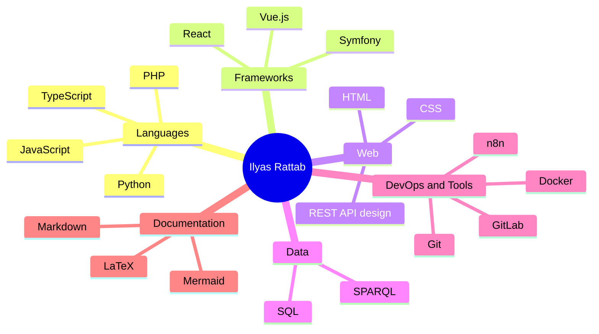

<!--
  Profile README for github.com/ITC2022  (English)
  Keep this file (README.md) together with README.de.md in the ITC2022 repo.
  Stats & repo cards: github-stats-extended.vercel.app  |  Streak: github-readme-streak-stats
  Accent colour: #6C63FF  |  Card theme: tokyonight
-->

<b>English</b> &nbsp;·&nbsp; <a href="./README.de.md">Deutsch</a>

<h1 align="center">Ilyas Rattab</h1>
<h3 align="center">Full-Stack Developer · Berlin</h3>

  

  <a href="#about">About</a> &nbsp;·&nbsp;
  <a href="#tech-stack">Tech Stack</a> &nbsp;·&nbsp;
  <a href="#projects">Projects</a> &nbsp;·&nbsp;
  <a href="#github-stats">Stats</a> &nbsp;·&nbsp;
  <a href="#contact">Contact</a>

---

## About

Full-Stack Developer based in Berlin. I build clean, working web applications — mostly **Vue 3** on the frontend with **PHP / Symfony** and **REST APIs** on the backend, deployed using **Docker**. I like the parts of development that reward patience: debugging, documentation, and shipping features end to end.

---

## Tech Stack

**Languages**

**Frameworks**

**Web & Data**

**DevOps & Tools**

**Documentation**

---

## Projects

- **BooksStore** — a bookstore management app (PHP).
- **PflanzOra** — a plants CRUD application (PHP).
- **SportKurse** — a sports-courses management app (PHP).
- **Pokémon Trainers** — a Pokémon trainers app (PHP).
- **WaveCast** — a frontend web project (CSS).

  
  
  
  
  

---

## GitHub Stats

  
  

  

---

## Contact

  
  
  
  

