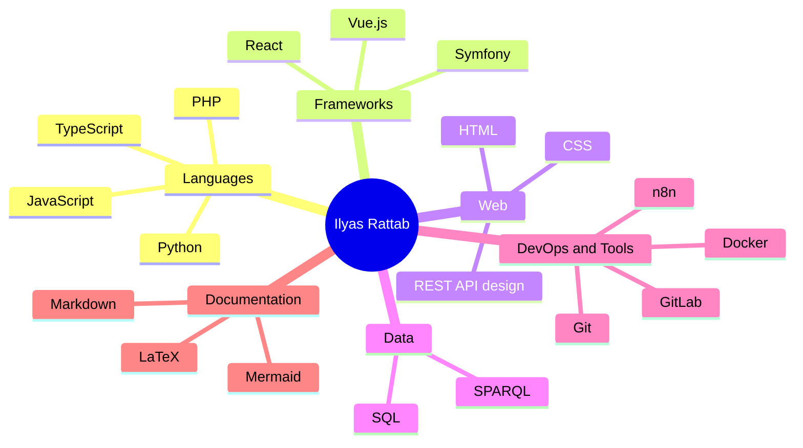
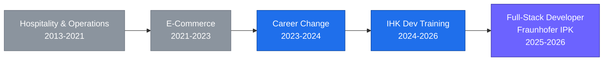

<!--
  Profile README for github.com/ITC2022  (English)
  Keep this file (README.md) together with README.de.md in the ITC2022 repo.
  Stats: github-stats-extended.vercel.app  |  Streak: github-readme-streak-stats
  Accent colour: #6C63FF  |  Card theme: tokyonight
-->

<b>English</b> &nbsp;·&nbsp; <a href="./README.de.md">Deutsch</a>

<h1 align="center">Ilyas Rattab</h1>
<h3 align="center">Full-Stack Developer · Berlin</h3>

  

  <a href="#about">About</a> &nbsp;·&nbsp;
  <a href="#tech-stack">Tech Stack</a> &nbsp;·&nbsp;
  <a href="#career-path">Career Path</a> &nbsp;·&nbsp;
  <a href="#experience">Experience</a> &nbsp;·&nbsp;
  <a href="#education">Education</a> &nbsp;·&nbsp;
  <a href="#languages">Languages</a> &nbsp;·&nbsp;
  <a href="#github-stats">Stats</a> &nbsp;·&nbsp;
  <a href="#contact">Contact</a>

---

## About

After more than a decade in operations and customer-facing roles, I made a deliberate move into software development — bringing the same ownership and attention to detail I applied to hospital logistics and e-commerce to writing clean, working code. Most recently at **Fraunhofer IPK** I contributed to production code within an agile team, building with **Vue 3, REST APIs, and Docker**. I enjoy the parts of development that reward patience, from debugging to documentation, and I'm looking for a team where I can keep growing while bringing that operational mindset with me.

---

## Tech Stack

**Languages**

**Frameworks**

**Web & Data**

**DevOps & Tools**

**Documentation**

---

## Career Path

---

## Experience

| Period | Role | Company · Location |
| :--- | :--- | :--- |
| 2025–2026 | Full-Stack Developer (Internship) | Fraunhofer IPK · Berlin |
| 2024–2026 | IT Specialist – Application Development (IHK) | BBQ GmbH · Berlin |
| 2023–2024 | Career Change & Retraining Prep | Grone & Comcave · Berlin |
| 2023 | Sales Manager | Fenchem Biochemie GmbH · Cologne |
| 2021–2023 | E-Commerce Manager | Warnke Marketing Services · Cologne |
| 2017–2021 | Chef & Kitchen Operations | St. Franziskus-Hospital · Cologne |
| 2013–2017 | Receptionist | Hotel Timone · Porto San Giorgio, IT |

---

## Education

| Qualification | Institution | Year |
| :--- | :--- | :--- |
| Certified Software Developer (IHK) | BBQ GmbH, Berlin | 2024–2026 |
| E-Commerce Manager Certification (IHK) | Cologne | 2022 |
| Digital Marketing Fundamentals | Google Digital Training | 2022 |
| Technical Secondary School Diploma | Istituto Luigi Einaudi, Italy | 2015 |

---

## Languages

---

## GitHub Stats

  
  

  

---

## Contact

  
  
  
  

